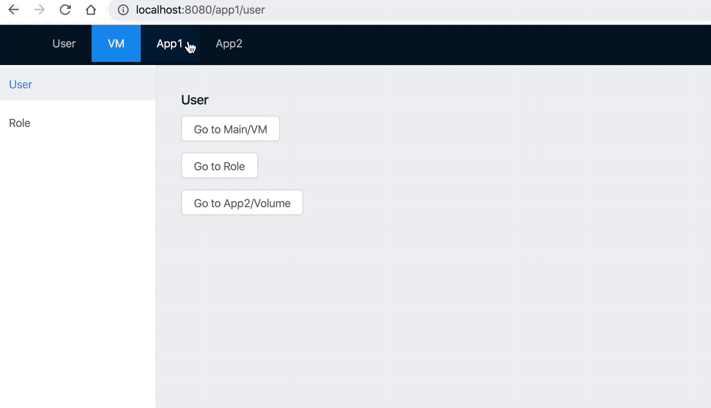

本 demo 负责排查 single-spa 和 react-router 联用产生的 bug

启动项目

```
# single-spa 和 history 以 link 方式安装，见下文
$ git clone https://github.com/shengbeiniao/single-spa-demo
$ cd single-spa-demo
$ yarn 
$ yarn start
```

提供一种解决前端开源库 bug 的一般思路，以 single-spa 为例

```
# clone 目标代码库，并yarn link
$ git clone https://github.com/single-spa/single-spa.git
$ cd single-spa
$ yarn link
$ cd your_repo
$ yarn link single-spa

# 配置 webpack resolve alias
{
  resolve:{
    alias:{
      'single-spa':'single-spa/src/single-spa.js'
    }
  }
}
```dd
打开 chrome devtools，切换到 sources，打开FileSystem，导入 single-spa 文件夹，这样就可以在源码打断点了，观察调用栈，判断执行逻辑


> 引言

    react-router-dom Router组件 初始化时会调用 history.listen
    
    history.listen 会调用checkDOMListeners，会捕获浏览器的 popState 事件
    
    history.push 会调用 globalHisory.push，被 single-spa 的 navigation-events 捕获，调用 urlReroute，并额外生成了一个 popState 事件，最后被 history 处理
    
    无论是 history.push 还是 history.handlePopState，最终都会调用 history.setState 改变 location，并执行 notifyListeners，将变更的 location 传递给 Router 组件，Router 通过 context 向下传递，被 Switch 组件捕获，clone 相关的 Page Compon

### 主应用和子应用均使用 react-router-dom

> 主应用跳转到子应用具体页面

    render 一次
    
    singleSPA.navigateToUrl --> singleSPA.urlReroute --> singleSPA.popState --> history.handlePop --> history.setState --> history.notifyListeners --> Router

> 主应用跳转到子应用首页，首页包含 react-router-dom/Redirect
    
    render 三次

    一次被 Switch 捕获
    剩下两次因为 Redirect mount 时会调用 replace，传递到 single-spa popState，被 history 捕获
    
> 子引用跳转到主应用

    render 两次
    
    主应用执行 history.push，触发 single-spa popState，再被主应用 history 捕获

> 子应用内部跳转

    render 三次
    
    一次正常处理
    history.push --> history.setState --> history.notifyListeners --> Router
    
    两次监听处理
    history.push --> globalHistory.push --> singleSPA.urlReroute --> popState Event --> history.handlePop --> history.setState --> history.notifyListeners --> Router
    
    Router 组件监听 history，将 location 状态设置在 context 中，被 Switch 组件捕获，然后 clone 对应的 Page 组件进行页面渲染，如果 Page 组件在三次渲染期间属性未变更，那 Page 不会重复渲染，可以打开 React devtools Profiler 进行验证

    如果 Page 被 React-redux/dva connect 包裹，props 可能出现异步变更，情况比较复杂，这里很容易出错，所以不建议主应用和 React/history 耦合


### 主应用不含 react-router-dom

> 子应用内部跳转

    render 两次
    第一次 history.push
    第二次 singleSPA popState

> 主应用跳转到子应用具体页面

    render 一次
    
    Switch 组件 mount 直接根据 location 渲染

> 主应用跳转到子应用首页，首页包含 react-router-dom/Redirect
    
    render 两次
    
    第一次 Switch 组件 mount 直接根据 location 主动渲染
    
    第二次 Redirect 组件 replace 触发 singleSPA popState，被动渲染
    
> 子应用跳到另外一个子应用
    
    如果子应用不含 react-router-dom

    场景比较简单，子应用只会渲染一次
    
    如果子应用包含 react-router-dom，逻辑同上